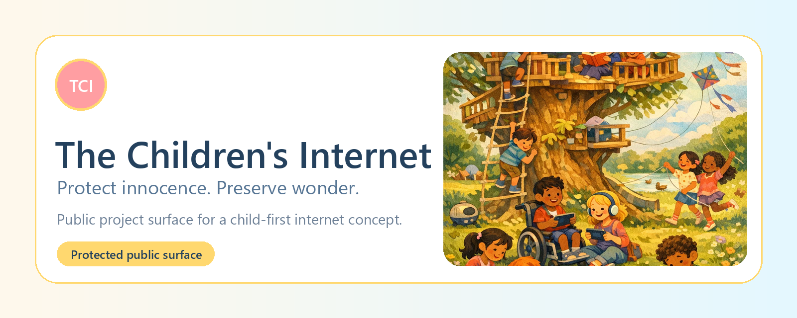
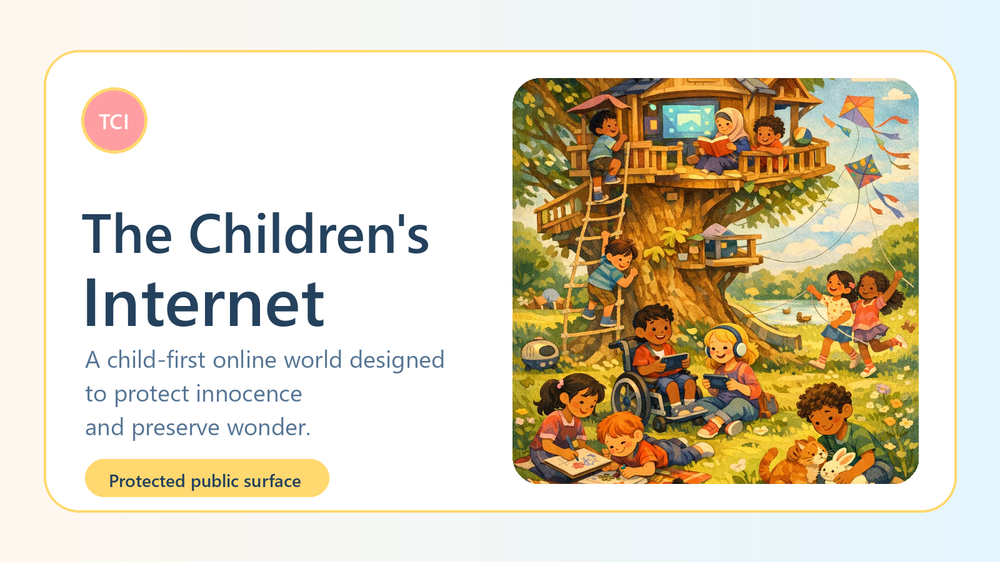
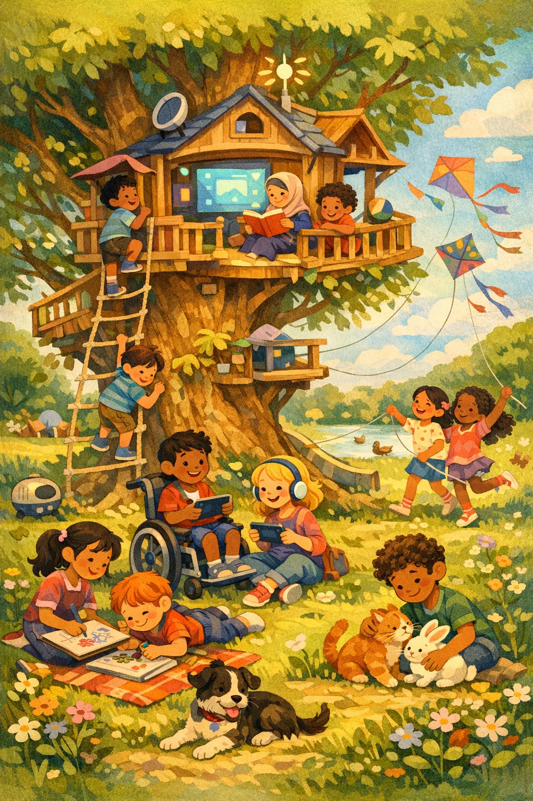
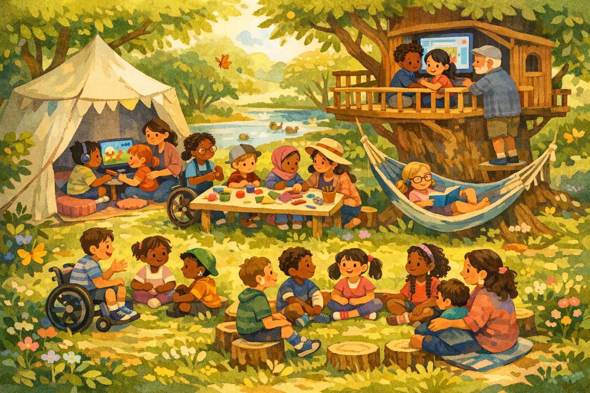
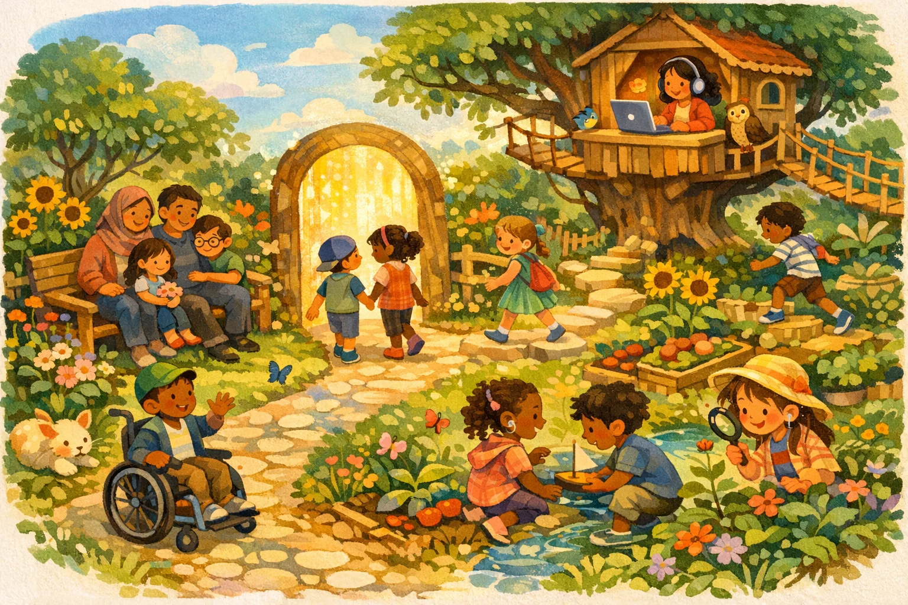
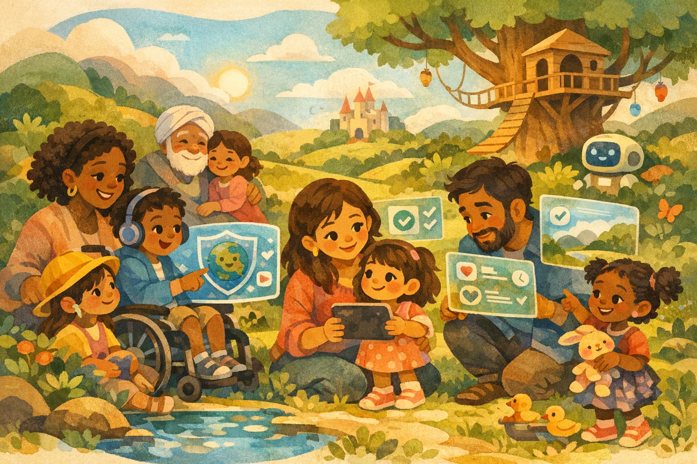
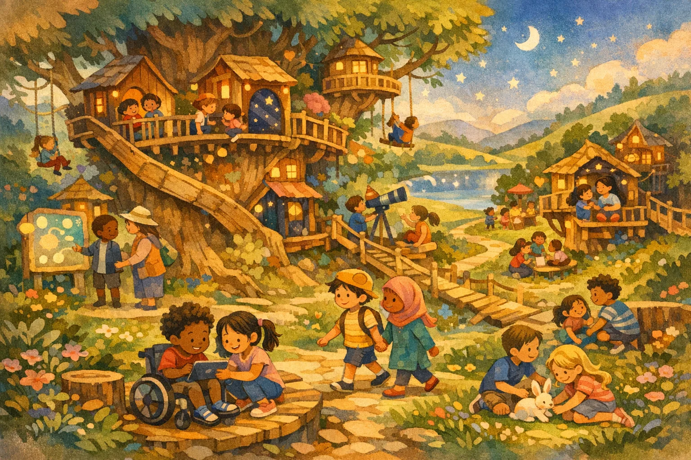
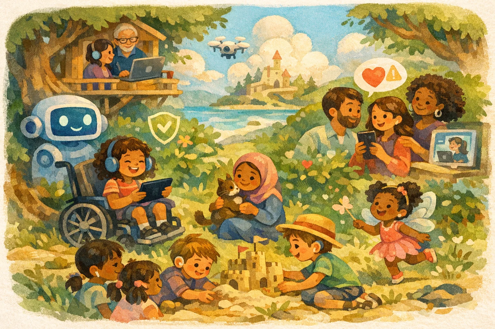

# The Children's Internet

The Children's Internet is a child-first internet concept and presentation surface for protected exploration, family trust, accountable moderation, and verified child-only access.

This repository is a protected public project surface. It is not the full source code, operational system, private workflow, or data room.

## Why It Matters

Children deserve online spaces that preserve wonder before exposure teaches fear. The Children's Internet imagines a separate digital layer where play, learning, clubs, browsing, family guidance, and safety operations are designed together from the start.

## Who It Is For

- Families who want meaningful visibility without turning trust into constant surveillance.
- Schools, libraries, and community partners thinking about safer digital spaces for children.
- Product, safety, and policy reviewers evaluating a child-first internet model.
- Future collaborators who need the public story without access to private implementation material.

## How It Works

The current public demo presents the system as a static microsite:

- Vision route for the emotional promise.
- Interactive demo route for child, parent, moderator, and verification scenarios.
- System route for the trust architecture.
- Pitch route for presentation mode.

Live microsite:

https://faithcheltenham.com/kidsinternet/

## Public Surface

This repository contains:

- Project brief and current status.
- Public/private boundary documentation.
- Workflow diagrams.
- Ownership and commercial-use notices.
- Public-safe visual assets.
- WordPress page draft materials.
- Privacy review and launch checklist.

## Protected Materials

The following remain private:

- Source code and build system.
- Prompts, agent instructions, private workflows, and receipts.
- Credentials, server details, deployment adapters, and operational infrastructure.
- Unpublished legal, administrative, family, medical, benefits, customer, or private strategy records.
- Any future backend implementation for accounts, verification, moderation, dashboards, reporting, or compliance.

## Workflow Overview

The project separates public storytelling from protected operational systems. The public surface explains the concept; private systems remain behind review, approval, and deployment boundaries.

## Public / Private Boundary

## Visual Gallery

| Hero | Demo World | System Garden |
|---|---|---|
|  |  |  |

| Family Trust | Pitch Vision | Safety Operations |
|---|---|---|
|  |  |  |

## Current Status

The Children's Internet is currently a static React/Vite presentation microsite, not a live backend product. Account creation, identity verification, parent dashboards, moderation queues, reporting, compliance workflows, and school deployment are represented as narrative demo material only.

## Learn More

- Project brief: [docs/PROJECT_BRIEF.md](docs/PROJECT_BRIEF.md)
- Status: [docs/STATUS.md](docs/STATUS.md)
- Public/private boundary: [docs/PUBLIC_PRIVATE_BOUNDARY.md](docs/PUBLIC_PRIVATE_BOUNDARY.md)
- WordPress page draft: [wordpress/page.md](wordpress/page.md)
- Commercial use policy: [docs/COMMERCIAL_USE_POLICY.md](docs/COMMERCIAL_USE_POLICY.md)

## Ownership

Copyright (c) Faith Cheltenham / XXYYZZ Society LLC. All rights reserved.

No public license is granted. No redistribution, model training, commercial use, source release, or implied permission is granted.
